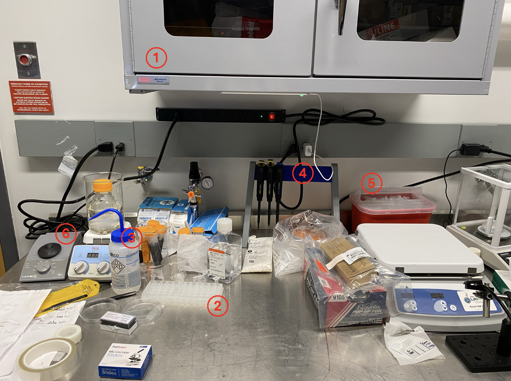
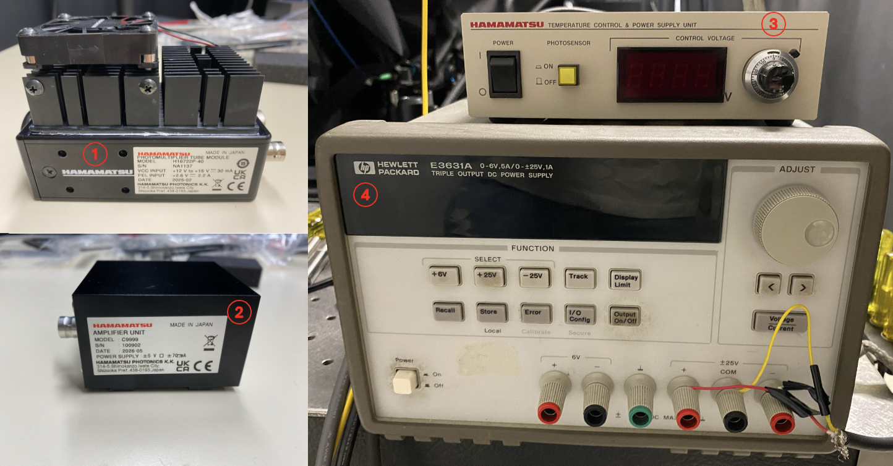
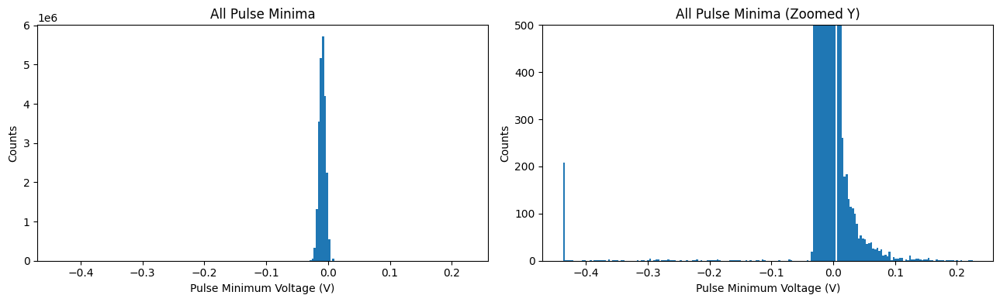
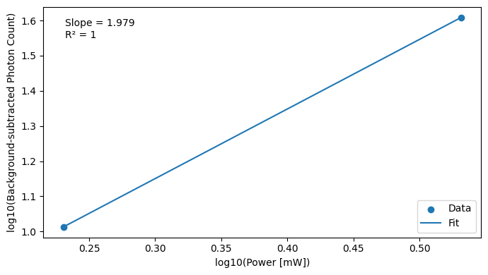

# Dye pool photon counting protocol

## Materials:

- NIST Fluorescein [(Thermo Fisher F36915)](https://www.thermofisher.com/order/catalog/product/F36915); concentration $C_{fluo} = 50\times 10^{-6} \text{mol/L}$
- Deionized (DI) water (obtained from BU NPC)

---

## Dilution calculation

1. Take $90\ \text{µL}$ of DI water as the base medium.
2. The dye pool is prepared by mixing:

- DI water solution: $V_{DI} = 90\ \text{µL}$
- Fluorescein: $V_{fluo} = 10\ \text{µL}$

3. The concentration of Fluorescein:

$$
\frac{C_{fluo} \times V_{fluo}}{V_{fluo}+ V_{DI}}
= \frac{(50 \times 10^{-6}\ \text{mol}/\text{L}) \times (10\ \text{µL})}{(10+90)\ \text{µL}}
= 5 \times 10^{-6}\ \text{mol}/\text{L}
$$

---

## Equipment and Supplies

### Sample preparation 

1. Microcentrifuge tubes 
(e.g., [BKMAMLAB](https://www.amazon.com/Microcentrifuge-Sterilized-Plastic-Storage-Without/dp/B0BBV2LMW6/ref=sr_1_4?crid=25C67XB8W2600&dib=eyJ2IjoiMSJ9.xPCQBU3akLQF9rlTcVTk80aYDqlnaLlgpIB3o61syALNo4YVZ7pK2TRhUSHHzbtyePx1n4N1VfY8Aj9sUqRUC6LP2Sn7Orz1mKqxCnoEVPYP5y-dbozyev0I&th=1), 
[Thermo Fisher 69720](https://www.thermofisher.com/order/catalog/product/69720))
2. Tube rack (e.g., [Weramics](https://www.amazon.com/microcentrifuge-centrifuge-Holder-0-5ml-2ml-Centrifugal/dp/B0D8R66MQ1/ref=sr_1_3?crid=1ZI3PYB3G9CUW&dib=eyJ2IjoiMSJ9.YORppysqg2ETX3WIv1hENrcBaf5mFiQT1zwaMrziZxj4AO9c8Xdj1H7rB4cdGXhXPN5NPZLih2-Zv4NAnjZxWRS0aKGhmVgp_CD9SMFMh5y9FSw52Hk&th=1), [Sigma Aldrich HS29025G-5EA](https://www.sigmaaldrich.com/US/en/product/sigma/hs29025g?utm_source=google&utm_medium=cpc&utm_campaign=23331190685&utm_content=194830326172&gad_source=1&gad_campaignid=23331190685&gbraid=0AAAAAD8kLQT9hVwcGrJZokAPJjItG0NNi&gclid=CjwKCAjw5ZXQBhBdEiwAI5XVWf9K6cRtAhF6BAougAjviP_rQfLuJX6rEvGCAW4uzJG8zfSE7cYZ4BoC63MQAvD_BwE))
3. DI water (obtained from BU NPC), stored in a wash bottle. 
4. Pipettes covering $2\sim20\ \text{µL}$ and $20\sim200\ \text{µL}$ volume ranges (e.g., [Thermo Fisher F2-20R and Thermo Fisher F2-200R](https://pipette.com/F2-20R.html)), stored in a pipette stand. 
5. Sharps disposal container (obtained from BU EHS department)
6. Vortexer (e.g., [VWR IKA Model MV1](https://www.marshallscientific.com/VWR-IKA-Model-MV1-Vortexer-p/vwr-ika.htm?srsltid=AfmBOop9bjFGTjvm6mfIoLMPdbEW2Kp7j4NSZWPVejsxydbgDRdUsfgK))

**Additional items not labeled in the figure:**

- Microscope slide (e.g., [AmScope slide](https://amscope.com/products/bs-50p?_su_rec=dvzX1JygNKH83jx8M9-sJSabLn47ZUmB17fe-Sdp6B5Glkz5qs0SEmUuswS1bymGIfx1Dk5vWTNEyAlE8eN7o0e-K-hBfZ4XVl-l6425ZBBscnY0ho8R9RaV18beMmb6hYfxDUga2EmhT6hcMWZclyjs4E5CaxTYUGcjEDd-CJW8pBUX49gwDeVTyxUM7c4_ZV_YJDLk9do-tq2BQ2aLZk7ZUPCF-INT0tonFkUf3I8VdWFjUKswlMsW&_su_rec_id=e8dbe9ae-768f-407d-a4ff-80304caa7649-1781120714); $3"L\times 2.5"W\times1"H$)
- Coverslip (e.g., [Thorlabs CG15CH2](https://www.thorlabs.com/item/CG15CH2), $#1.5\text{H}\ \text{thickness}$, $22\ \text{mm} \times 22 \text{mm}$)
- Cotton swab (e.g., [VWR International 10806-000-PK](https://www.labdepotinc.com/p-64-cotton-tipped-wooden-applicators?utm_term=&utm_campaign=Performance+Max+-+AGT&utm_source=adwords&utm_medium=ppc&hsa_acc=5326096552&hsa_cam=15278638752&hsa_grp=&hsa_ad=&hsa_src=x&hsa_tgt=&hsa_kw=&hsa_mt=&hsa_net=adwords&hsa))
- Nail polish (e.g., [Sally Hansen](https://www.amazon.com/Sally-Hansen-Advanced-Nails-Fluid/dp/B0046MLZLG?th=1))
- Glue (e.g., [Kcrazy glue](https://www.amazon.com/Krazy-Glue-EPIKG86648R-KG86648R-All-Purpose/dp/B0BXMWDM42/ref=sr_1_8?crid=2H3DLY2HBZ1CP&dib=eyJ2IjoiMSJ9.ZVQWAnzUL49sypVj2K7n-leSSrUo7HbydfUd-yI2bc795v5Pu9ScxNl3HniW7hCEcXaGtl3xIBKb4z0qt5psn8JYd0jh3G0daA0tnMldLPD4FYgdFbVpa6mZ_Phrbjb&th=1))

### Detection 

1. Photomultiplier tube (PMT) (e.g., [Hamamatsu H16722P-40](https://shop.hamamatsu.com/products/photomultiplier-tube-module-h16722p-40))
2. Preamplifier (e.g., [Hamamatsu C9999](https://www.hamamatsu.com/content/dam/hamamatsu-photonics/sites/documents/99_SALES_LIBRARY/etd/C9999_TACC1041E.pdf))
3. PMT power supply (e.g., [Hamamatsu C8137-02](https://shop.hamamatsu.com/products/power-supply-c8137-02))
4. Preamplifier power supply (e.g., [Keysight E3631A](https://www.keysight.com/us/en/product/E3631A/80w-triple-output-power-supply-6v-5a--25v-1a.html))

**Additional items not labeled in the figure:**
- Oscilloscope (e.g., [Rigol DHO4404](https://www.digikey.com/en/products/detail/rigol-technologies/DHO4404/17801279))
---

## Dye pool sample preparation
- Retrieve two [microcentrifuge tubes](#eq-tubes) from the cabinet and place them into the [tube rack](#eq-rack). Dispense approximately $1\ \text{mL}$ of [DI water](#eq-di) from the wash bottle into a tube. 

- Using the pipettes from the pipette stand, pipette $10\ \text{µL}$ of fluorescein with a [$2\sim20\ \text{µL}$ pipette](#eq-pipettes) and $90\ \text{µL}$ of DI water with a [$20–200 \text{µL}$ pipette](#eq-pipettes) into the same tube. Dispose of the pipette tips into the [sharps container](#eq-sharpcontainer).

- Turn on the [mini vortexer](#eq-vortexer) and set the speed to $1400\ \text{rpm}$. Place the tube on the vortexer and mix thoroughly (approximately $40$ second). 

- Using a $2–20\ \text{µL}$ pipette, pipette $20\ \text{µL}$ of the mixture and dispense it into the [slide](#eq-slide).

- Slowly lower the [coverslip](#eq-coverslip) from the side so that it gently covers the sample on the slide and avoid pressing down forcefully to reduce bubble formation.

- Lightly press the coverslip with a [cotton swab](#eq-swab) to squeeze out excess liquid, which is wiped out from the edges using a cotton swab to keep the edges clean.

- Apply [nail polish](#eq-polish) to the four edges of the coverslip first to fix it in place and allow it to dry for approximately 5 mins.

- Once the nail polish is dry, apply [glue](#eq-glue) along the four edges of the coverslip to further enhance the seal.

- Mark the date and name of the sample on the slide.

---

## Photon counting measurement
  > ⚠️ **PMT protection:** Keep the room as dark as possible before turning on the PMT. Exposure to bright ambient light while the PMT is powered can produce excessive photocurrents and may permanently damage the detector. Ensure that all external light sources are eliminated before enabling the PMT.
1. **PMT Setup and Initialization**

&nbsp;&nbsp;&nbsp;&nbsp;&nbsp;&nbsp; Before measurements can be performed, the PMT and its associated electronics must be properly connected and powered. The PMT output is first amplified by a preamplifier and then sent to a data acquisition device. In the example described below, an oscilloscope is used for signal monitoring and acquisition. (Throughout the setup procedure, ensure that the PMT remains covered to prevent exposure to ambient light.)

- Turn on the preamplifier power supply and adjust the $+25\ V$ and $-25\ V$ output channels to $+5\ V$ and $−5\ V$, respectively. Connect the power input of the preamplifier to the power supply, the preamplifier output to the oscilloscope, and the PMT output to the preamplifier input. Verify all connections before proceeding.

- Turn on the oscilloscope and connect it to the local area network (LAN) for remote communication and data acquisition. Set the memory depth to $10\ \text{Mpts}$. Set the horizontal time scale to $100.00\ \text{ms/div}$ and verify that the resulting sampling rate is $10\ \text{MSa/s}$.

- Connect the PMT to its power supply. Turn on both the PMT power supply and the photosensor. Gradually increase the PMT control voltage while monitoring the oscilloscope output until clear negative pulses become visible. Increase the PMT control voltage until single-photon pulses are clearly resolved above the electronic noise floor. Record this value as the PMT operating voltage, denoted by $V_{PMT}$, which will be used for all subsequent measurements. 

- The appearance of these pulses indicates that the detector, electronics, and power connections are functioning properly. Once proper operation has been verified, reduce the PMT control voltage back to $0\ \text{V}$ before proceeding.

2. **System Bootup and Power Calibration**

&nbsp;&nbsp;&nbsp;&nbsp;&nbsp;&nbsp; For this measurement, we need to know the exact excitation light power under the objective lens during photon count acquisition. This usually requires a calibration step, and we describe it below for a system using Pockels cells to control excitation light power:

- Turn on the laser, set the laser to the desired wavelength, and wait for it to warm up until its power stabilizes. Normally, it takes $10\sim30$ minutes depending on the laser.

- Place a power meter with an appropriate measurement range at or near the focal point of the objective lens to ensure that the entire laser beam is collected. Usually one can use a thermal power meter. For semiconductor power meters, it is more preferable to use an integration sphere, especially for high NA objective lens. Open the laser shutter and observe power readings.

- Turn on the multi-photon microscope. Gradually increase the Pockels cell control voltage and record the corresponding laser power after the beam passes through the objective lens.

- Repeat the procedure and establish a lookup table between Pockels cell control voltage and the absolute optical power after the objective lens. Since the relation is nonlinear, some interpolation may be needed later on.

3. **Locating Sample and its Surface**

&nbsp;&nbsp;&nbsp;&nbsp;&nbsp;&nbsp; Before the measurements can begin, the sample surface must be located so that the focal point can be positioned at a known depth within the fluorescent dye solution. 

- Place the dye pool slide on the microscope sample stage. Bring the objective lens close to the sample surface (at a distance less than its working distance, e.g., $1\ \text{mm}$). Apply immersion medium between the objective and the slide.

- Keep the room as dark as possible before removing the PMT cover and increasing the PMT control voltage. Carefully examine if there are any external light sources that can leak into the detector. Adjust the PMT control voltage to $V_{PMT}$. After powering on the PMT, allow $15\sim30$ minutes for the detector to stabilize before collecting data.

- Set the laser power after the objective to a relatively low power, normally $1\sim2$ mW, but this depends heavily on the system. Turn on laser scanning mirrors and begin streaming data. Gradually move the objective lens away from the sample at a fixed step size of typically $10\sim20\ \text{µm}$ until a noticeable increase in the photon count rate is observed.

- Continue to bring the objective lens away from the sample until the photon count rate decreases abruptly; this marks the location of a sample surface. If possible, reset the z-coordinate of the sample surface to $0$; otherwise, note down its coordinate. Regardless of the numerical value, the sample surface is denoted as $z_0$. 

- Stop mirror scanning and dwell the focus within the dye pool. Move the objective toward the sample until the focal point is located at least $10\ \text{µm}$ below $z_0$. Ensure that he focal volume remains fully immersed in the dye pool and does not intersect the coverslip interface.

4. **Verification of the Power Scaling of Multi-photon Excitation**

&nbsp;&nbsp;&nbsp;&nbsp;&nbsp;&nbsp; Before quantitative measurements are performed, the power dependence of the detected signal should be verified. By comparing photon counts acquired at two different excitation powers, one can confirm that the measured signal follows the expected scaling law of multi-photon excitation.

- Keep the laser running without mirror scanning and acquire several PMT output traces at a known excitation power. Record the excitation power, then increase it by a factor of two and repeat the acquisition without moving the sample or modifying any imaging settings.

- Determine the total number of detected photons for each acquisition (the [photon-counting procedure](#photoncount) is described in the Data Analysis section below). For two-photon excitation (2PE), verify that the photon count obtained at the higher excitation power is approximately $4×$ that obtained at the lower excitation power, while for (three-photon excitation) 3PE it should be approximately $8×$. If the expected scaling is not observed, reduce the excitation power and repeat the two acquisition steps above until the appropriate nonlinear scaling is achieved. If the photon count remains too low to reliably verify the scaling relationship, the noise level and signal collection efficiency of the system should be investigated.

5. **Background Measurement**

- Keep the laser shutter closed, and acquire multiple PMT output trace _under exactly the same imaging condition and image acquisition configurations as the rest of imaging sessions_, except that the excitation laser is blocked.

- One can choose to take these background at any point during the experiment. Sometimes it is preferred to take them at both the beginning and the end of the image experiment to verify that the background stayed constant throughout the experiment session.

- After all measurements have been completed, reduce the PMT control voltage to $0\ \text{V}$ and acquire several PMT output traces under the same acquisition settings. These recordings can be used to estimate the noise level and establish an appropriate threshold for photon counting during data analysis. 

- Once the noise measurements have been collected, turn off the PMT power supply and the preamplifier power supply, and replace the protective cover on the PMT.

---

## Data processing ([Example](https://github.com/TYW-Lab/PMT_PhotonCounting_Protocol/blob/main/PMT_calibration/20260609_PMT_2Pverification/ND1.5/data_analysis.ipynb))

1. **Photon Count Estimation** 

- Use the PMT waveforms acquired at a PMT control voltage of 0 V as the noise reference dataset. For each noise waveform, determine the largest absolute voltage excursion. Select the largest value observed across all noise waveforms as the noise reference level $V_{\text{noise}}=\max\left(|V_{\text{noise data}}|\right)$. 

- Using the PMT waveforms acquired during fluorescence measurements, identify all local minima using a peak-finding algorithm. Combine the minima from all measurement waveforms and generate a pulse-height histogram. The pulse-height histogram typically contains two overlapping populations: electronic noise and photon-induced PMT pulses. The local valley between these populations provides a natural boundary for separating noise fluctuations from photon events. An example of minima pulse-height historgram is shown in the figure below. 

- Search for local valleys in the pulse-height histogram. Among all valleys satisfying $V_{\text{valley}} < V_{\text{noise}}$. Select the valley closest to the noise reference (i.e., the largest valley voltage) as the photon-counting threshold $V_{\text{th}}=\max \left(V_{\text{valley}}\mid V_{\text{valley}} < V_{\text{noise}} \right)$. 

- Classify a minimum as a photon event if $V_{\min} < V_{\text{th}}$. The total number of photon events detected within the acquisition window is recorded as the photon count for that waveform. 

- If desired, a more conservative threshold may be defined as $V_{\text{th,strict}}=V_{\text{th}} - 5\sigma$, where $\sigma$ is the standard deviation of the measured PMT signal.

2. **Determination of the Power Scaling of Multi-photon Excitation**

- For each excitation power setting, estimate the photon count rate from the PMT waveform using the [photon-counting procedure](#photoncount) described above.

- Apply the same analysis to the corresponding background measurement to obtain the background photon count rate.

- Subtract the background contribution from the measured photon count rate to obtain the net photon count.

- Take the natural logarithms of the net photon count rate $Photon$ and excitation power $Power$, then perform a linear fit of $\ln(Photon)$ versus $\ln(Power)$:
  
$$
\ln(Photon) = k \ln(Power) + b
$$

&nbsp;&nbsp;&nbsp;&nbsp;&nbsp;&nbsp;&nbsp;&nbsp;&nbsp; where $k$ is the effective order of the multiphoton excitation process. For an ideal 2PE process, $k = 2$, whereas for an ideal 3PE process, $k = 3$. 

- An example of the fitting result is shown in the figure below.

